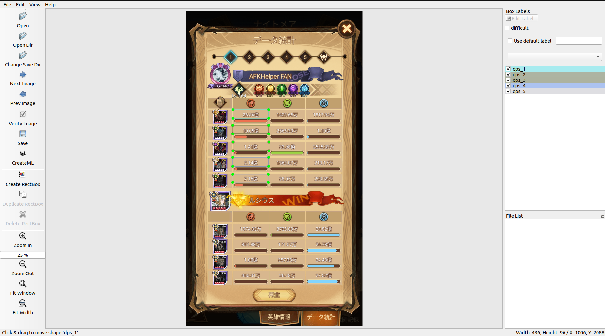
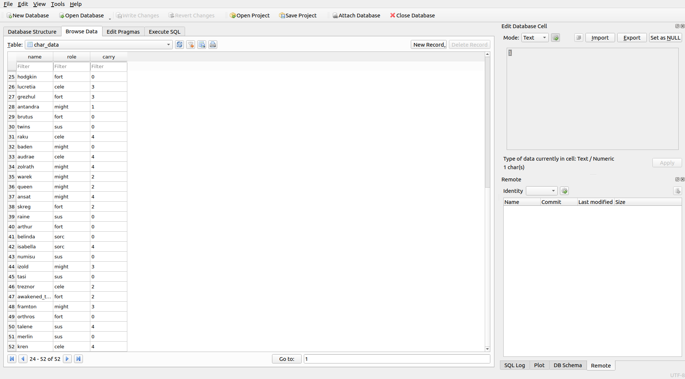
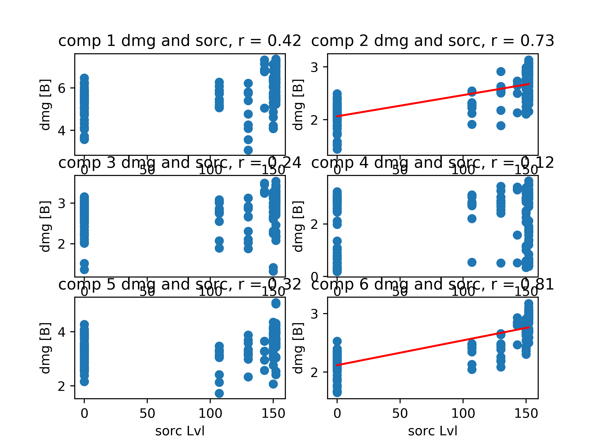
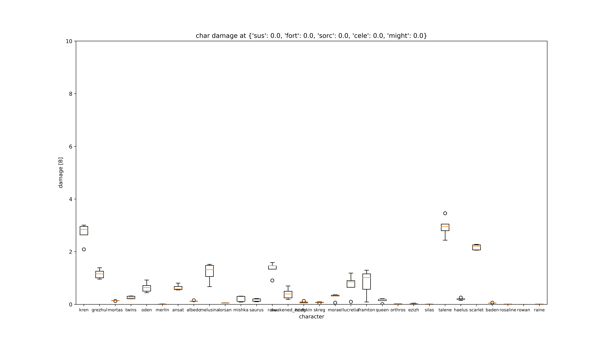
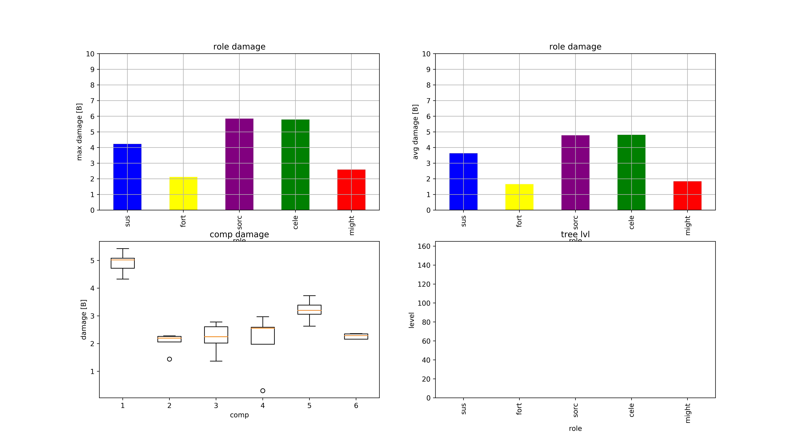

# cr_analyzer
auto detecting AFK Arena CR Results with OCR.

## Dependencies
### Python  
pytesseract  
opencv-python  
numpy  
matplotlib  
pandas  
labelImg    

### System
tesseract    
sqlite3   

## Setup
1. Install dependencies.
2. Use 4K screenshots as possible. If you are using emulator, this can be tweaked easily in settings.
3. put the screenshots of the statistics as these format
data/{trial}/{round}.png

2. do labeling of the results statistics and save as dmg_data_4k.json.
The labels are dps_1, dps_2, dps_3, dps_4, dps_5 from 1-5 position.
It only works on fixed resolution setup, so this needs to be setup again if you use another smartphone or friend's sceenshot.  

```bash
labelImg
```



3. Enter what character did you use in the data/char_label/{round}.json. This feature would be refined by editing in gui in future.  
```json
{"dps_1" : "raku", "dps_2": "grezhul", "dps_3" : "rosaline", "dps_4" : "estrilda", "dps_5" : "twins"}
```

4. Modify the db char_data.db using sqlite browser and add new character and roles.  


## Run

1. convert the screenshot name to [1-6].png
```bash
./rename_img_files.bash [boss] [trial_start] [trial_end]
```  

2. add tree information as tree.json in each trial.  
```json
{"sus" : 130, "fort" : 108, "cele" : 150, "might": 5, "sorc" : 152}
```

3. execute this command  
```bash
./analyze_cr_batch.bash [boss] [trial_start] [trial_end]
```

4. To get the reports, execute this command
```python  
python3 trial_summary.py
```  
The reports are generated in reports/ folder.





